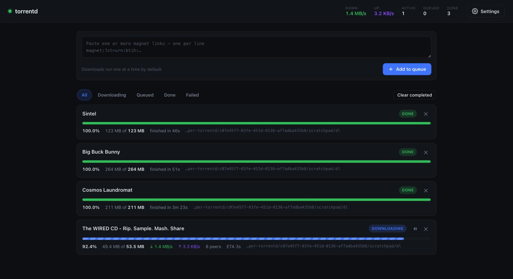

# torrentd

[](https://github.com/Dev-Pasaka/torrentd/actions/workflows/docker-publish.yml)

A small self-hosted server that takes magnet links, downloads them one at a
time, and saves the files to a folder you choose. Comes with a live web UI
showing per-download progress, speed, peers and ETA.



## Deploy the published image

Every push to `main` publishes a multi-arch image (linux/amd64 + linux/arm64) to
Docker Hub as [`pascarl/torrentd`](https://hub.docker.com/r/pascarl/torrentd).
Deploying it needs no clone and no build — one compose file is enough.

Create a directory on the host, save this as `docker-compose.yml` inside it:

```yaml
services:
  torrentd:
    image: pascarl/torrentd:latest
    container_name: torrentd
    restart: unless-stopped
    user: "1000:1000"            # `id -u`:`id -g` — owns the downloaded files
    ports:
      - "127.0.0.1:8080:8080"    # UI. Drop the 127.0.0.1 only behind TLS.
      - "6881:6881/tcp"          # peers (BitTorrent)
      - "6881:6881/udp"          # peers (uTP) — same port, other protocol
      - "6882:6882/udp"          # DHT
    volumes:
      - "./downloads:/downloads" # change the LEFT side to save elsewhere
      - ./data:/data             # SQLite: queue + settings
    environment:
      TORRENTD_USER: admin       # omit both to get a generated password
      TORRENTD_PASS: ""          # in the logs on first start
```

Then:

```bash
mkdir -p downloads data
docker compose up -d
docker compose logs torrentd     # the generated password is printed here
```

Or without a compose file at all:

```bash
docker run -d --name torrentd --restart unless-stopped \
  -p 127.0.0.1:8080:8080 -p 6881:6881/tcp -p 6881:6881/udp -p 6882:6882/udp \
  -v "$PWD/downloads:/downloads" -v "$PWD/data:/data" \
  --user "$(id -u):$(id -g)" \
  pascarl/torrentd:latest
```

Upgrading pulls the new image and recreates the container; `./data` and
`./downloads` are bind mounts, so the queue, settings and files all survive:

```bash
docker compose pull && docker compose up -d
```

Pin a version rather than tracking `latest` if you want upgrades to be
deliberate — tagging a release (`git tag v1.1.0 && git push --tags`) publishes
`pascarl/torrentd:1.1.0` and `:1.1`, and every build is also tagged with its
commit as `:sha-<short>`.

## Run from source with Docker

```bash
cp .env.example .env      # optional — every value has a default
mkdir -p downloads data
docker compose up -d --build
docker compose logs torrentd    # the generated password is printed here
```

Then open <http://127.0.0.1:8080>. Downloads land in `./downloads`, the database
in `./data`, both bind-mounted so they survive `docker compose down`.

## Choosing where downloads land

The container always writes to `/downloads`; what changes is the host folder
bound to it. Set `DOWNLOADS_DIR` in `.env` and leave the container side alone —
the saved download path in Settings keeps working across moves:

```ini
DOWNLOADS_DIR=/Volumes/Media/torrents
DOWNLOADS_DIR=./downloads                        # relative to the compose file
DOWNLOADS_DIR=/srv/jellyfin/media/Shows&Movies   # no escaping needed, no shell runs
```

`DATA_DIR` moves the SQLite database the same way. Point `DOWNLOADS_DIR` inside
a media library and the files are picked up in place — no copy, no symlink:

```yaml
# elsewhere in a stack that also runs Jellyfin
- "./jellyfin/media/Shows&Movies:/downloads"
```

For more than one destination, mount each as a subfolder of `/downloads` — they
all show up in the picker and you switch between them in Settings:

```yaml
volumes:
  - /mnt/tank/movies:/downloads/movies
  - /mnt/tank/shows:/downloads/shows
```

> **The folder picker browses the container, not the host.** Inside Docker,
> **Browse…** shows the container's filesystem, where the only host folder that
> exists is `/downloads`. Mount the host folders you want reachable and pick
> them under `/downloads`; changing the setting to a path that only exists in
> the container writes into the container's writable layer and is lost on
> recreate.

Files in `./downloads` are owned by uid/gid `1000:1000` by default. If that is
not you, set `PUID`/`PGID` in `.env` to your `id -u` / `id -g`.

The compose file publishes the UI on `127.0.0.1` only, and maps three
BitTorrent ports: 6881 on **both** TCP and UDP for peers — the connection pool
binds a TCP server and a uTP (UDP) server on the same number, so publishing only
one protocol turns away half the inbound peers — plus 6882/UDP for DHT. The peer
and DHT ports have to be different numbers; WebTorrent binds them separately and
logs `EADDRINUSE` if they collide. Forward all three on your router for better
peer connectivity, and change
`BT_PORT`/`DHT_PORT` in `.env` if another client on the machine already has
them.

## Run without Docker

```bash
npm install
npm start
```

Then open <http://127.0.0.1:8080>.

On the **first run** a random password is generated and printed to the console:

```
  ┌─ first run: generated login ───────────────
  │  username: admin
  │  password: k7Rm2xQpL9vB
  └─ change it under Settings in the UI ───────
```

Change it from **Settings → Login** in the UI, or set it yourself up front:

```bash
TORRENTD_USER=me TORRENTD_PASS=something-long npm start
```

## Using it

1. Open **Settings** and pick a download folder — type a path or use **Browse…**
   to walk the server's filesystem and create folders.
2. Paste one or more magnet links into the box (one per line) and hit
   **Add to queue** (or ⌘/Ctrl + Enter).
3. Items download **one at a time** in queue order. The UI updates once a second
   over a WebSocket.

Per item you can pause, resume, retry a failure, move it up or down the queue,
and remove it. Removing asks whether to delete the downloaded files or keep them.
**Clear completed** empties finished rows from the list and always keeps files.

Pausing stops the transfer but leaves the partial data on disk; resuming
re-checks what is already there and continues from that point.

## Configuration

Everything in Settings is stored in SQLite and survives a restart.

| Setting | Meaning |
| --- | --- |
| Download folder | Where files land, on the machine running the server. Created if missing. |
| Concurrent downloads | 1–10. `1` means strictly one at a time. |
| After finishing | *Stop* frees the slot immediately. *Keep seeding* shares completed files back until you remove them. |
| Username / password | HTTP Basic credentials. The password is stored scrypt-hashed. |

Environment variables, all optional:

| Variable | Default | Meaning |
| --- | --- | --- |
| `PORT` | `8080` | HTTP port |
| `HOST` | `127.0.0.1` | Bind address. Use `0.0.0.0` to expose on your LAN — read the security note first. |
| `TORRENTD_DATA` | `./data` | Where `torrentd.db` lives |
| `DOWNLOAD_DIR` | `~/Downloads/torrentd` | Initial download folder (first run only; after that the UI setting wins) |
| `TORRENTD_USER` / `TORRENTD_PASS` | generated | Seed the login instead of generating one |
| `TORRENT_PORT` / `DHT_PORT` | random | Pin the BitTorrent peer / DHT ports if you want to forward them |
| `NAT_UPNP` / `NAT_PMP` | off | Set to `1` to enable UPnP / NAT-PMP port mapping — see below |

## How it works

- **WebTorrent** is the BitTorrent engine: magnet resolution, DHT, trackers,
  peer transfer. A short list of public trackers is appended to every torrent,
  since bare magnets often carry no announce list.
- **SQLite** (`better-sqlite3`) stores the queue and settings. Live counters
  (speed, peers, ETA) are in-memory and pushed over the WebSocket; progress is
  checkpointed to the DB every 5 seconds, which is enough to survive a restart.
- **Express** serves the JSON API and the static UI behind HTTP Basic auth.
  Browsers cannot set an `Authorization` header on a WebSocket, so the page
  fetches a single-use, 60-second token from an authenticated endpoint and
  passes it in the socket URL.
- If the process dies mid-download, rows left in `downloading` are reset to
  `queued` on the next boot and picked up again.

## Troubleshooting slow downloads

Speed is mostly a property of the swarm and of your network, not of the client.
Before assuming something is broken, check in this order.

**Is UDP getting out?** BitTorrent uses UDP for `udp://` trackers, for DHT, and
for uTP. Plenty of VPNs and corporate networks drop it entirely, which quietly
kills peer discovery — you get a handful of peers or none, on every torrent.

```bash
# no reply within a few seconds means UDP is blocked
node -e "const s=require('dgram').createSocket('udp4');const b=Buffer.alloc(16);
b.writeUInt32BE(0x417,0);b.writeUInt32BE(0x27101980,4);b.writeUInt32BE(0,8);b.writeUInt32BE(1,12);
s.on('message',()=>{console.log('UDP OK');process.exit(0)});
s.send(b,1337,'tracker.opentrackr.org');setTimeout(()=>{console.log('UDP BLOCKED');process.exit(1)},8000)"
```

If it reports blocked, the `http://` trackers in the default list are what keep
things working — they announce over TCP. Disconnecting the VPN, or using one
that permits P2P, restores DHT and the UDP trackers and usually helps a lot.

**Is the torrent itself well seeded?** A release with one reachable peer will
crawl no matter what you do; that peer's upload speed is your ceiling. Compare
against a known-healthy torrent before blaming the setup — a well-seeded one
should reach several MB/s.

**Can peers reach you?** Without an open port you only get peers you dial out
to. Forward `BT_PORT` (TCP) and `DHT_PORT` (UDP) on your router, or set
`NAT_UPNP=1` to have the client ask for the mapping itself.

## Security notes

- **This is not hardened for the open internet.** HTTP Basic sends credentials
  base64-encoded, not encrypted — over plain HTTP anyone on the path can read
  them. It binds to `127.0.0.1` by default for that reason. If you expose it,
  put it behind a reverse proxy with TLS.
- Anyone who can log in can browse the server's directory tree (folder names
  only, not file contents) and write downloads anywhere the server process can
  write. That is inherent to letting the UI pick a destination folder.
- `npm audit` reports 4 high-severity advisories, all the same one: the `ip`
  package's `isPublic` misclassifies some encodings of private addresses
  (GHSA-2p57-rm9w-gvfp). It reaches us transitively through
  `webtorrent → torrent-discovery → bittorrent-tracker → ip`. There is no
  patched version — `npm audit fix --force` "resolves" it by downgrading
  WebTorrent from 3.x to 0.7.3, which is not viable. Left as-is deliberately;
  the exposure is a malicious tracker coaxing a connection to a private address,
  which matters much more if you expose this beyond localhost.
- NAT port mapping is **off by default**. The `nat-api` library never attaches
  an `error` listener to its NAT-PMP socket, so a bind conflict — port 5350 is
  commonly taken on macOS — becomes an unhandled event that kills the process.
  DHT and outgoing peer connections work fine without it; enabling it only helps
  peers reach you. Turn it on with `NAT_UPNP=1` / `NAT_PMP=1` if you want it.

## Layout

```
server/
  index.js    HTTP + WebSocket, routes, startup
  manager.js  WebTorrent client, the one-at-a-time queue, live stats
  db.js       SQLite schema, settings, prepared statements
  auth.js     Basic auth + WebSocket handshake tokens
public/       the UI (no build step, no framework)
data/         torrentd.db (gitignored)
```

`old-kotlin/` holds an earlier Ktor prototype, kept for reference; nothing in
the running app touches it.

Only download content you have the legal right to.
